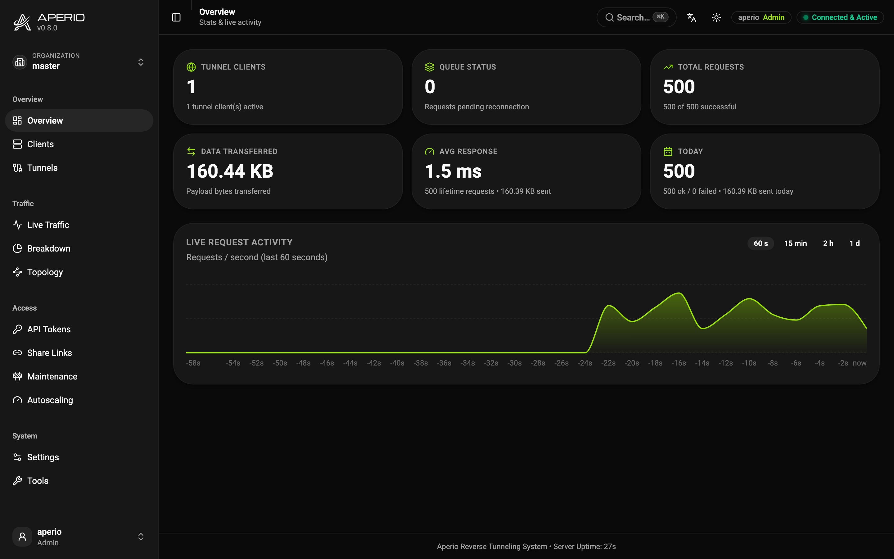

#  Aperio

Put a local service on the public internet through one outbound connection. No inbound ports, no port-forwarding, no firewall holes. Self-hosted, written in Rust.

```
        Public request                        Outbound WebSocket tunnel
[ Visitor ] ────────────▶ [ aperio-server ] ◀═══════════════════════ [ aperio-client ]
                                 │                                          │
                                 ▼                                          ▼
                        Admin dashboard /aperio                     [ Local backend ]
```

The client always dials **out**, so nothing on your network accepts inbound connections.

## Why Aperio

- **It is yours.** Both sides are binaries you run: no account, no third-party relay, no traffic through someone else's infrastructure, nothing to price per tunnel or per seat.
- **Two binaries and a token.** No database, no message broker, no sidecar. The server keeps its state in a file next to it; the dashboard is compiled into the binary.
- **One connection out.** The tunnel is a WebSocket the client opens, so the machine serving your app can sit behind NAT, CGNAT or a firewall that allows nothing inbound.
- **Small enough to leave running.** Measured on an Apple M-series laptop: the server binary is 14 MB (dashboard included) and idles at ~14 MB RSS; the client is 6 MB and idles at ~6 MB. Neither grows with request count.
- **It is a product, not a pipe.** A live dashboard, a request inspector with replay, scoped tokens, organizations, caching, failover, autoscaling hooks and messaging between clients ship in the same binaries.

[](docs/dashboard.md)

## Quick start

```bash
# Server (public box)
docker run -d -p 8080:8080 -v ./data:/app/data \
  -e APERIO_SERVER_TOKEN="a-long-random-string" \
  ghcr.io/co3moz/aperio-server:latest

# Client (next to your service)
docker run -d --network host \
  -e APERIO_SERVER_TOKEN="a-long-random-string" \
  -e APERIO_SERVER_URL="http://your-server-ip:8080" \
  -e APERIO_TARGET="http://localhost:3000" \
  ghcr.io/co3moz/aperio-client:latest
```

Or one line with the CLI:

```bash
curl -sSf https://raw.githubusercontent.com/co3moz/aperio/master/install.sh | sh
aperio-client 3000 --server-url https://tunnel.example.com --server-token apr_xxxx
```

With Homebrew, or Scoop on Windows:

```bash
brew install --formula https://github.com/co3moz/aperio/releases/latest/download/aperio-client.rb
```

On an ordinary Linux box, a package with a hardened service unit:

```bash
sudo dpkg -i aperio-client_0.9.0_amd64.deb    # or rpm -i, both attached to every release
sudo cp /etc/aperio/aperio-client.yaml.example /etc/aperio/myapp.yaml
sudo systemctl enable --now aperio-client@myapp
```

See **[Native packages and service units](docs/packages.md)**.

Dashboard at `/aperio` (user `aperio`, password = your token). Full walkthrough: **[Getting Started](docs/getting-started.md)**.

## What it carries

| | Supported |
|---|---|
| **HTTP** | HTTP/1.1 and HTTP/2 (h2c and h2), streamed request and response bodies, `Range` requests, trailers |
| **WebSocket** | passed through end to end, with per-stream flow control |
| **gRPC** | over h2c/h2, `te: trailers` forwarded, `grpc-status` relayed back |
| **TCP** | declared tunnels bound from another client (`--bind-tunnels`) or opened on a public port (`expose:`) |
| **UDP** | the same, as a best-effort datagram relay; `tcp/udp` declares one tunnel on both |
| **Static files** | a directory served with no backend at all: SPA fallback, custom 404, streaming |
| **Messages** | clients of one organization publish and subscribe over the tunnel they already hold, with an MQTT or plain-HTTP local face |

## What it does with it

|                     |                                                                                                                                                        |
| ---------------------| --------------------------------------------------------------------------------------------------------------------------------------------------------|
| **Routing**         | hostname and path binds, round-robin, primary-standby tiers, sticky sessions, random subdomains, in-flight failover                                    |
| **Access**          | scoped dynamic tokens (rate limits, quotas, IP pinning, expiry), visitor passwords, OIDC/SSO, share links, TOTP and passkeys for operators             |
| **Tenancy**         | organizations with their own clients, tokens, users, hostname fences and quotas, and a super-admin who moves between them                              |
| **Traffic control** | response caching with serve-stale, per-route rate limits, a small request firewall (`waf:`), maintenance mode, static routes and redirects             |
| **Operations**      | live dashboard, request inspector with replay and cURL/HAR export, kill switch, config hot-reload, graceful drain, autoscaling hooks                   |
| **Observability**   | Prometheus metrics, OpenTelemetry traces, structured access log, tamper-evident audit trail, webhooks with retries and an inbox                        |
| **Hardening**       | end-to-end encrypted tunnels the server only relays, admin IP fencing, login lockout, token pinning, canary tokens, SSRF fencing on outbound callbacks |

Throughput is not the interesting number for most deployments, the tunnel adds one hop, and the backend is usually what you are waiting for, but for scale: ~7,800 requests/second through the tunnel on loopback, with a trivial backend and one keep-alive connection, on the same laptop as above. Concurrency is where the number actually lives: the same setup serves ~22,000-25,000/second at a hundred connections, with the per-visitor rate limit raised out of the way (at its default it is the limiter you are measuring, not the tunnel). Both figures are floors rather than records, taken on a laptop with other work on it.

## Use it for

- **Showing work in progress.** A localhost port on a real URL, with TLS in front and a password or a share link on it.
- **Preview environments.** One ephemeral hostname per pull request, minted through the API, torn down when it merges. There is a [GitHub Action](docs/ephemeral-tunnels.md) for the whole flow.
- **Publishing from where you cannot open ports.** A machine behind NAT or CGNAT, a home server, a customer's network, a device in the field, serving traffic through an outbound connection.
- **Reaching a private service in an incident.** A database or an SSH daemon that is exposed to nobody, bound locally from another machine for as long as you need it.
- **Running it as infrastructure for other people.** Organizations, per-tenant quotas and hostname fences, per-token rate limits, and an audit trail of who did what.

## Documentation

Click a feature for the details.

**1. Getting started & configuration**

- [Getting Started](docs/getting-started.md), server and client running in five minutes, Docker or CLI.
- [Configuration](docs/configuration.md), every setting on both sides: env, CLI, or yaml.
- [Configuration Examples](docs/examples/README.md), ready-to-adapt config pairs, one folder per scenario.
- [Client Resilience](docs/client-resilience.md), reconnect backoff, health probes, graceful drain.
- [Behind a Dynamic Edge Proxy](docs/edge-proxy.md), let Traefik or Caddy learn the hostnames that only exist at runtime.

**2. Traffic & routing**

- [Routing & Load Balancing](docs/routing-and-load-balancing.md), hostname/path binds, priority tiers, sticky sessions.
- [Random Subdomains](docs/routing-and-load-balancing.md#random-subdomains), an automatic `a1b2c3.example.com` on a wildcard domain.
- [In-Flight Failover](docs/failover.md), survive a client dying mid-request without the visitor noticing.
- [Response Caching](docs/caching.md), serve GETs without touching the tunnel.
- [Static File Serving](docs/static-serving.md), publish a directory with no backend behind it.

**3. Tunnels & protocols**

- [Tunnel Protocol](docs/tunnel-protocol.md), WebSocket pass-through, chunked bodies, gRPC over h2c/h2.
- [Tunnels](docs/emergency-tunnels.md), reach a database, an SSH daemon or a DNS resolver through the same connection, end-to-end encrypted if you want it.
- [Messages Between Clients](docs/messaging.md), publish a topic and every subscribed client of the organization hears it; the server's own events are on `$aperio/`.
- [PR Preview Tunnels](docs/ephemeral-tunnels.md), one ephemeral hostname per pull request, with a GitHub Action.

**4. Security & access control**

- [Visitor Auth & SSO](docs/tokens-and-auth.md#protecting-proxied-traffic), OIDC or a password in front of a proxied site.
- [Access Tokens](docs/tokens-and-auth.md#dynamic-tokens), scoped, revocable, rate-limited, IP-pinned.
- [Share Links](docs/share-links.md), temporary visitor access with no account.
- [Production Hardening](docs/production-hardening.md), the pre-flight checklist, and the [Threat Model](docs/threat-model.md) behind it.

**5. Management & operations**

- [Admin Dashboard](docs/dashboard.md), live traffic, request inspector and replay, maintenance mode, kill switch.
- [Admin API from the CLI](docs/cli-api.md), script it all: `aperio-client api share | token | ...`.
- [Autoscaling](docs/autoscaling.md), cold start from zero on the first request, scale out when the pool saturates.
- [Multi-tenancy](docs/organizations.md), isolated organizations on one server.

**6. Observability**

- [Metrics, traces & logs](docs/observability.md), Prometheus, OpenTelemetry, webhooks, access and audit logs.

Full index: **[docs/](docs/README.md)**. Prefer one long read? [**The Complete Guide**](docs/book/aperio.tex) is a single-file LaTeX book covering all of it in one narrative, with generated reference tables for every setting, endpoint and protocol message. Every release carries it built: [aperio-guide.pdf](https://github.com/co3moz/aperio/releases/latest/download/aperio-guide.pdf).

## Security

- Front it with TLS, set `trust_proxy`, use `https://` / `wss://` URLs.
- Prefer scoped dynamic tokens. Treat the master token like a root password.
- The client only talks to its configured targets and caps message sizes.

More: **[Tokens & Authentication](docs/tokens-and-auth.md)**, and the [Threat Model](docs/threat-model.md) for what each side is trusted to do.

Releases are signed with [Sigstore](https://www.sigstore.dev/) and carry build provenance and an SBOM, so a downloaded binary can be verified rather than trusted, see [SECURITY.md](SECURITY.md#verifying-a-release). Found a vulnerability? [Report it privately](https://github.com/co3moz/aperio/security/advisories/new), never as a public issue.

## Contributing

Bug reports, reproductions and documentation fixes are as welcome as code. [CONTRIBUTING.md](CONTRIBUTING.md) is the front door, [docs/development.md](docs/development.md) the detail, and [planned_features.md](planned_features.md) what is planned, shipped, or dropped and why.

## License

Open-source and free to use.
