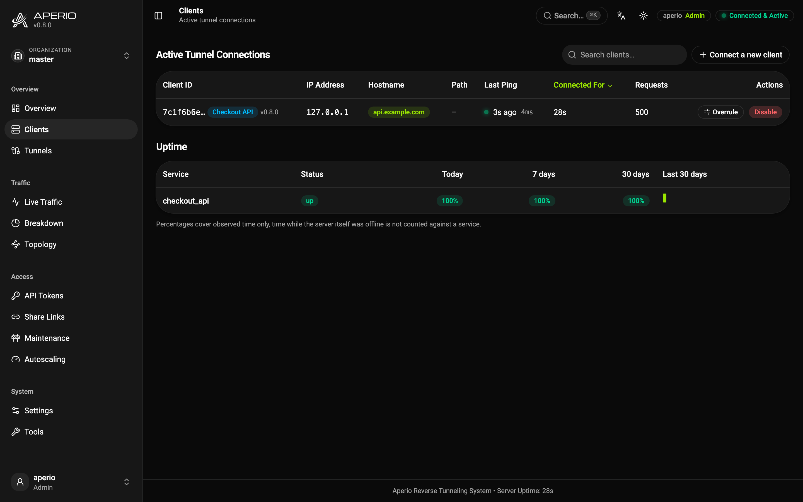
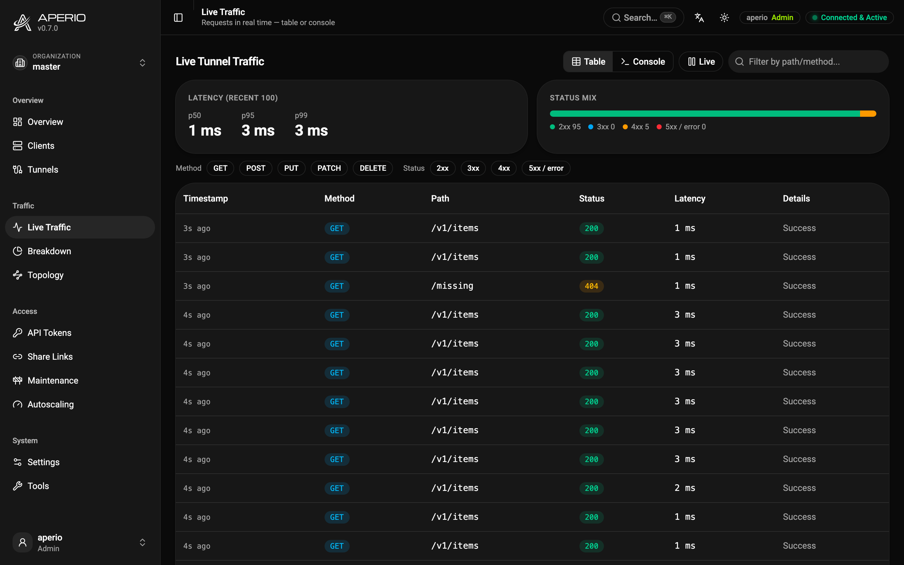
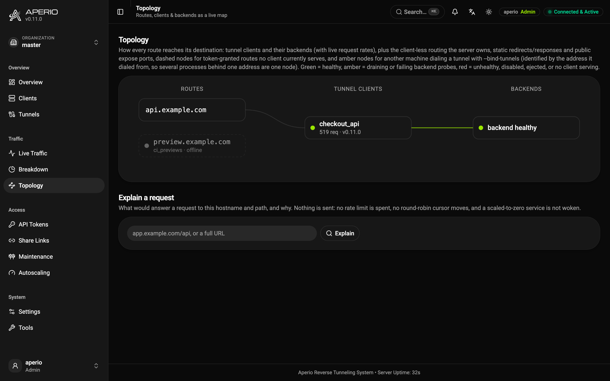
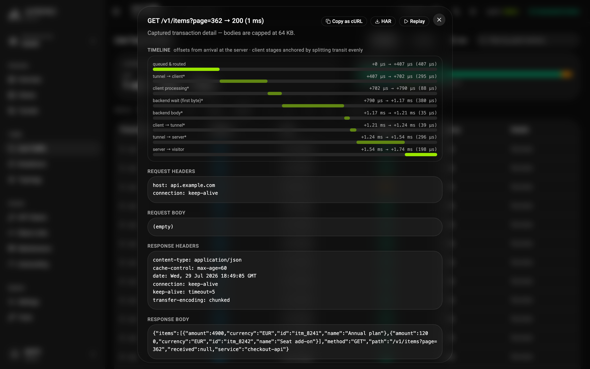

# The Dashboard

The admin dashboard lives at `/aperio` (login: `aperio` / master token, or a named dashboard user). It is a Vite + React app embedded into the server binary, no extra deployment.

## Live overview

Connected clients, a request-rate chart, lifetime average response time, and today's traffic, persisted across restarts. The whole live view is pushed over a single Server-Sent Events stream (`/aperio/api/stream`): `stats` events (the connections list and counters, every 2s) and `traffic` events (one per request) rather than polling. It falls back to polling only if the stream can't be established; the session-expiry check is the one thing still polled (once a minute).

## Clients table

Every connected client with its binds, health dot, last heartbeat, client version (with a warning badge on tunnel protocol mismatch), standby tier, announced concurrency limit, and a `BACKEND DOWN` badge when the client's own health probe is failing.

The *Hostname* column shows one name, the one the client asked for itself, since a name the operator chose identifies the service better than a token-granted or randomly assigned one. Every other hostname routed to the connection collapses into a `+N` badge that lists them on hover.

Clicking a row opens that connection's **effective configuration** as a YAML document: what the client announces over its heartbeat (binds, concurrency limit, bandwidth, priority, public/auth, IP allowlist, cache and resilience flags, body limits, declared tunnels) plus what the server applies on top. Settings a client never announces (its target, request timeouts, header rules, health probes) are not knowable server-side and are left out rather than guessed at. Every hostname is labeled with where it came from, and any setting whose effective value differs from what was configured is highlighted in place with a `# declared` comment and listed underneath: a `bandwidth` budget divided across parallel connections, a `connections` count clamped to the ceiling, an unparseable rate that was ignored, a `cache: true` the server's disabled cache makes a no-op, a `public` or `auth` declaration the token does not permit, or an active overrule. Each is tagged with who resolved it, the client (before announcing) or the server. Raw data: `GET /aperio/api/clients/{id}/config`. Two controls act on live clients:

- **Enable/Disable kill switch**, a disabled client stays connected but receives no new traffic. Useful for taking a backend out of rotation without touching its machine.

Below the table, an **Uptime** panel tracks each service's availability history: current status (up / degraded / down), uptime percentages for today, the last 7 days, and the last 30 days, plus a per-day color strip. A background ticker (every `APERIO_UPTIME_TICK_SECS` (yaml `uptime_tick_secs`) seconds, default 10) accrues time as *up* (tunnel healthy and backend probe passing), *degraded* (connected but not serving, backend down, draining, or disabled), or *down* (no connection); history is persisted in `aperio.db` for 60 days. Percentages cover observed time only, time while the server itself was offline is not counted against a service. Also available as `GET /aperio/api/uptime`.
- **Overrule**, temporarily override a client's hostname/path binds, e.g. to redirect a hostname live. In-memory only; a reconnect or restart reverts it. The dialog opens with one row per hostname the connection currently answers on, the ones the client declared first, then the random subdomain on its own row, each labeled with where it came from. Editing a single row moves only that name, so retargeting the hostname the client configured leaves the random subdomain routing as it was, and emptying every row clears the override.

## Live traffic table

The traffic table is streamed live: the server pushes each proxied request over Server-Sent Events (`/aperio/api/stream`) as it completes, so rows appear the moment traffic flows instead of on a polling interval. If the stream can't be established (e.g. a proxy that buffers SSE) the table transparently falls back to periodic polling, and the **Live/Paused** toggle still freezes the view while you inspect. Latency percentiles (p50/p95/p99), a status-class mix bar, and method/status filters sit on top of the same feed.

## Console view

Live Traffic has a **Table / Console** toggle. The console is a `tail -f` for the access log: one monospace line per proxied request, time, status (color-coded), method, hostname, path, latency, and the error reason on failures, over the *same* SSE feed, search, method/status filters, and **Live/Paused** control as the table. It auto-scrolls while pinned to the bottom; scrolling up unpins it so history can be read (a *Jump to latest* button re-pins), and *Clear* empties the scrollback. Clicking a line opens the request inspector.

## Webhook inbox

The *Webhook Inbox* page (Traffic group) shows the inbound third-party webhooks (Stripe, GitHub, ...) persisted for services that opted in with `webhook_inbox: true` in the client config: every POST routed to such a service is stored (headers and payload, restart-surviving, newest 500 kept) so an event that arrived while the backend was down or misbehaving is never lost. Each entry expands into its (redacted) headers and pretty-printed payload, and **Re-fire** re-dispatches the original request to whichever client currently serves the route, the cure for "Stripe fired while my laptop was closed". Entries can be deleted one by one or the whole inbox cleared; re-fires are audit-logged (`webhook_refired`).

## Topology

The *Topology* page (Traffic group) draws the reverse-tunnel mesh as a live three-column map, routes → tunnel clients → backends, with a per-client live request rate on the edge, health-colored (green healthy, amber draining or failing backend probes, red unhealthy / disabled / ejected). Unlike the clients table it also shows the routing the server owns with **no live client**: static `routes:` (redirects / fixed responses) and public `expose:` ports as self-contained nodes, and token-granted binds that no client currently serves as dashed **offline** nodes, so "the service that should be up but isn't" is visible at a glance. Backed by its own `/api/topology` endpoint. See [Response Caching](caching.md) and [Routing & Load Balancing](routing-and-load-balancing.md) for the underlying concepts.

## Route trends

The *Breakdown* page opens with **route trends**: for every hostname, one bar per minute over the last 30 minutes, height by request volume, color by the worst status class seen in that minute (green 2xx/3xx, amber 4xx, red 5xx), plus the window's request count and 5xx error rate. The glanceable "which route started erroring, and when". In-memory (last 60 minutes tracked, up to 100 routes); raw data at `GET /aperio/api/route-trends`.

## Bandwidth accounting

The *Breakdown* page carries a **Bandwidth** report: bytes through the tunnel per token and per hostname, bucketed per day (last 14) or per month (last 6), the billing-style view. Each cell's tooltip splits the bucket into sent/received bytes and request counts; rows are ordered by total consumption. Buckets follow the standard stats retention (60 days / 24 months) and survive restarts. Raw data: `GET /aperio/api/bandwidth?unit=day|month&count=N`.

## Slowest endpoints

The *Breakdown* page also lists the **slowest endpoints**: a rolling in-memory latency window per `host|path` (query strings stripped), ranked by recent p95, with p50, max, lifetime request and 5xx counts per endpoint. Endpoints need a handful of recent samples before they appear, and up to 300 distinct paths are tracked (overflow folds into an *other* bucket). Also available raw at `GET /aperio/api/slow-endpoints`.

## Stage latencies

The Breakdown page carries a *Stage latencies* table: for every route, the rolling mean/σ/latest of each request stage (queue, tunnel transit per direction, client processing, backend wait/body, serve). A stage whose latest sample sits far above its usual band gets an **anomaly** badge, so a regression is attributable to a specific hop. Fed by the same timeline data as the inspector waterfall; `GET /aperio/api/stage-stats`.

## Request inspector & replay

Click any row in the traffic table to see full request/response headers and body previews (up to 64 KB per direction, last 50 requests), then **replay** the request through the tunnel with one click while debugging a backend, copy it as an equivalent `curl` command, or download it as a devtools-importable HAR file.

**Every buffered capture carries a high-resolution timeline**: microsecond stage offsets from the request's arrival at the server, queueing/routing, dispatch into the tunnel, the client's own stages (backend request sent, first byte, body complete, response handed back, measured on the client's monotonic clock and anchored by splitting the unaccounted tunnel transit evenly, marked as estimated), the response arriving back, and the hand-off to the visitor. The inspector renders it as a waterfall. Streamed responses and pre-timing clients simply omit it.

**Secrets are masked before anything leaves the server**: credential headers (`Authorization`, `Cookie`/`Set-Cookie`, `X-Api-Key` and friends) and secret-looking body fields (`password`, `token`, `api_key`, `client_secret`, … in JSON or form bodies) show as `[REDACTED]` in the inspector, and therefore also in the cURL copy and the HAR download. The raw capture stays intact in server memory, so replay still re-sends the original bytes. Opt out with `APERIO_INSPECTOR_REDACT=0` (yaml `inspector_redact`).

## Add Client wizard

Pick a token strategy (placeholder, or mint a scoped token on the spot), describe the local service, and copy a ready-to-run `docker run` / CLI / `aperio.yaml` snippet.

## Active sessions

Admins see every live dashboard session on the Users page, who is signed in, from which IP and browser, since when; the caller's own session is marked. Any session can be ended individually (its cookie stops working on the next request), and **Sign out everywhere else** ends all sessions but your own. Both actions are audited (`session_revoked`, `sessions_cleared`). The session list and its controls are admin-only, `GET/DELETE /aperio/api/sessions[/{id}]`.

## Maintenance mode

Put a hostname into maintenance: visitors get a 503 page (customizable via `APERIO_503_PAGE` (yaml `503_page`), served with `Retry-After`) while tunnel clients stay connected. Like bind overrides it is in-memory and cleared on restart. Toggles are audited and emitted as `maintenance_on` / `maintenance_off` webhook events.

Three shapes are accepted, the same two an organization's hostname allowlist is written in plus the server-wide one:

| Entry | Covers |
|---|---|
| `robogon.com` | that hostname, and nothing under it |
| `*.robogon.com` | every subdomain at any depth (`test.robogon.com`, `a.b.robogon.com`), **not** the apex, so list `robogon.com` as well if you want both |
| `*` | every hostname on the server; reserved for the master organization |

A flag carries a **reason** and, optionally, a **window**. The reason is shown on the 503 page and in the list, so the visitor and the next operator read the same sentence; a custom 503 page opts in by writing `{reason}` and `{until}` where it wants them, an existing page is unchanged. The window (`ttl_seconds`, or the dropdown) makes the flag lift by itself and makes `Retry-After` truthful instead of a fixed 300, because the flag that causes an outage is the one switched on for twenty minutes of work and left up. Without one it stays until someone turns it off, as before. The list shows who set each flag and when.

Clearing a flag is the organization's own, with one exception: master may clear any flag, including one whose organization has since been deleted. Deleting an organization also clears the flags it owned, so a tenant cannot leave a hostname answering 503 behind it.

A subdomain wildcard is the answer to "take everything under this domain down": one entry instead of one per service, and it covers services that connect while the flag is on. Because it is a claim over a whole subtree, it takes an organization that owns the subtree: an org fenced to `robogon.com` alone cannot set `*.robogon.com` (its fence covers one name), and master cannot set it either while a tenant is fenced to anything inside it.

## Organizations

When the built-in `aperio` super-admin is signed in, an **organization picker** appears at the top of the sidebar and an **Organizations** page (create / delete child organizations, with live user and token counts) is available. Switching organizations re-scopes every page, clients, tokens, users, traffic, stats, webhooks, audit, to the selected tenant. Named users don't see the picker: they are pinned to their own organization. See [Organizations](organizations.md).

## Settings dialog

The configuration screens open as a **dialog over whatever page you were on**, not as pages of their own: you open a setting, change it, and leave, and the traffic table you were watching is still there when you close it. Nothing about the dialog is in the URL, so a reload returns to the page underneath with the dialog shut, which is why a settings form holding unsaved edits asks before it is discarded, whether you close the dialog, switch panes, or reload the browser. Its panes are **Server Settings**, **Organizations**, **Users**, **Webhooks** and **Webhook Inbox**; each is still reachable by role (a viewer sees the webhook panes only, organizations and server settings are the master super-admin's).

## Server settings

Everything on this pane is **live**: a save applies immediately and takes effect on the running server, no restart and no reconnect. Environment variables and `aperio-server.yaml` stay the defaults; an edit becomes a **persisted override** (`APERIO_DATA_DIR/settings.json`) that survives restarts, wins over both, and can be reset per field back to the environment default. Every change is audited as `settings_updated`.

The settings sit in one accordion, grouped by what they govern. The full description of each is in the [Configuration Reference](configuration.md); this is what the screen can reach:

| Group | What you can change from here |
| --- | --- |
| **Gateway & Requests** | How long a request waits for a client to (re)connect and to answer, and the largest request body accepted (`APERIO_GATEWAY_TIMEOUT`, `APERIO_GATEWAY_RESPONSE_TIMEOUT`, `APERIO_MAX_BODY_SIZE`). |
| **Capacity & Health** | Ceiling on connected tunnel clients and on in-flight proxied requests, and the missed-heartbeat window after which a client leaves routing (`APERIO_MAX_TUNNELS`, `APERIO_MAX_CONCURRENT_REQUESTS`, `APERIO_CLIENT_DOWN_THRESHOLD`). |
| **Routing & Failover** | Load-balancing strategy, strict multi-tenant mode, and the whole in-flight failover policy: mode, jump count, time budget, and whether non-idempotent methods take part (`APERIO_LB_STRATEGY`, `APERIO_REQUIRE_HOSTNAME_BIND`, `APERIO_FAILOVER*`). |
| **Rate Limiting** | The per-visitor-IP token bucket: burst size and sustained rate (`APERIO_IP_LIMIT_MAX`, `APERIO_IP_LIMIT_REFILL`). |
| **Tunnels & Domains** | Tunnel compression, the random-subdomain pattern, and whether preview hosts answer `noindex` (`APERIO_TUNNEL_COMPRESSION`, `APERIO_RANDOM_SUBDOMAIN`, `APERIO_PREVIEW_NOINDEX`). Two of these reach connected clients at once: enabling compression is offered to them immediately, and a new pattern re-issues their random hostnames on the spot. |
| **Caching** | The response cache: on/off, its memory budget, and how long an expired entry may still answer while a resilient service has no healthy client (`APERIO_CACHE`, `APERIO_CACHE_MAX_BYTES`, `APERIO_CACHE_MAX_STALE`). Disabling it clears the stored entries. |
| **Stream Flow Control** | The backpressure watermarks: the backlog at which a producing client is told to pause, the one at which it resumes, and the hard cap past which a stream whose producer cannot be paused is dropped (`APERIO_STREAM_PAUSE_BYTES`, `APERIO_STREAM_RESUME_BYTES`, `APERIO_STREAM_BACKLOG_LIMIT`). |
| **Security & Audit** | Login brute-force lockout (threshold and base duration, which doubles per repeat) and `audit.jsonl` rotation size and generations kept (`APERIO_LOGIN_LOCKOUT_*`, `APERIO_AUDIT_MAX_*`). |
| **Visitor Experience** | Default dashboard/login language, the visitor password gate in front of all proxied traffic, and custom 504/503 HTML (`APERIO_UI_LANGUAGE`, `APERIO_SERVER_AUTH`, `APERIO_504_PAGE`, `APERIO_503_PAGE`). |
| **Export & Import** | The server as one JSON document, to move a deployment or keep a copy. A checkbox per section decides what travels: the six that rebuild a deployment (tokens, webhooks, users, organizations, autoscaling, settings overrides) are on by default, and the history the store also holds (statistics, uptime, the webhook inbox, admin API keys) is there for the asking. Leave **Organizations** out and only the master organization's rows travel, its statistics included, because a row whose organization does not exist on the target is an orphan; the pane says so before you download. Sessions and the audit log are never exported. |
| **Environment Flags** | Read-only: the env-only flags with their current values, and the exact way to change one on this host (a `docker run`/compose snippet or a shell/systemd one, chosen by what the server detects it is running in). |

**What is deliberately not here.** The master token, `HOST`/`PORT`, `data_dir`, proxy trust, secure cookies, OIDC, metrics, the access log and the outbound callback policy never become dashboard overrides: they are security- or startup-critical, and a compromised dashboard session must not be able to move them. Every one is still settable from `aperio-server.yaml` (or its environment spelling) and needs a restart. The pane lists them read-only rather than hiding them, so the screen still answers "what is this server actually running".

Server settings are a whole-server concern, so this pane and its export/import are reserved for the master super-admin; a named organization admin manages their own organization, not the server.

## Explain a request

The **Topology** page carries a box that answers the question a dashboard could never answer before: *why would a request to this hostname get that answer*. Type a hostname (or paste a URL) and the server walks the same decisions the proxy makes, in the same order, and marks the one that decides:

maintenance flag → `routes:` rule → preview `robots.txt` → `waf:` deny → `rate_limits:` rule → visitor gate → client selection → `fallbacks:` rule or the 504.

Every stage reports, not only the deciding one, which is the point: "the route is fine, a maintenance flag someone else set is what is answering" is a different fix from "no client is connected". When nothing serves the route, the report also names the clients that *could* have and why they did not, draining, disabled, failing their backend probe, missed heartbeats, or a path bind that does not match.

It is a dry run in the strict sense: it spends no rate-limit token, moves no round-robin cursor, and does not wake a scaled-to-zero service. Where a real check would be destructive (the route rate limit) it reports the rule instead of the outcome, and says so. Operator role and up, and an organization may only ask about hostnames its own fence admits, since the answer names the clients serving them.

`GET /aperio/api/explain?hostname=&path=&method=` is the same thing from a script.

## Messages

The settings dialog's **Messages** pane shows the one thing about [client-to-client messaging](messaging.md) that cannot be worked out from the outside: which client processes are listening, and to which topic filters. A publish that reached nobody looks exactly like one that reached everybody, and the difference is almost always a filter that does not match or a token without the topic; both are on this screen at once.

It also publishes. Type a topic and a message and the reply says how many client processes it reached, which is the fastest way to tell a wrong filter from a wrong topic, a publish that reaches nobody says so rather than reporting success. The *At least once* switch is `qos: 1`.

## Finding a setting

`Ctrl`/`⌘`+`K` searches the settings as well as the pages. Every server setting is listed by name, matching its English name, its translated one, its environment key (`max_body_size`) and its group, **with its current value on the right**, marked when that value is an override rather than the environment default. Half the reason to look a setting up is to check it, and that costs nothing here. Picking one opens the settings pane, expands the group holding it and scrolls to it. The palette also carries the dialog panes themselves and shortcuts that land on a form rather than a page (*Add User*, *New Organization*). Values are shown only to the master super-admin, since only they may read them.

## Also here

- **API Tokens / Webhooks**, create, edit, revoke (see [Tokens & Authentication](tokens-and-auth.md), [Observability](observability.md)).
- **Share links**, generate signed visitor-access URLs (see [Share Links](share-links.md)).
- **Traffic breakdown**, top consumers per token and per hostname, plus a **traffic history** chart over the persisted statistics: last 7/30/60 days, 26 weeks, 24 months, or a custom date range, with successful/failed requests, transfer volume, and average latency per bucket (`GET /aperio/api/stats/history`).
- **Audit log**, the last 200 administrative/security events (sidebar → **Tools**).

## Tools

The audit log, the API explorer and the config builder share a second dialog, **Tools**. None of them is where the day-to-day work happens: you open the audit log because something changed and you want to know who, the explorer because a call is not doing what you expected, the builder because a file needs writing. It is wider than the settings dialog, since a request/response pair and a generated YAML document are wide by nature.

## API explorer

The *API Explorer* pane (sidebar → **Tools**) renders the server's own `/aperio/api/openapi.json` as a browsable reference: operations grouped by tag, each expandable into its description, parameters, and an inline **try-it** form that runs the request against this very server with your current dashboard session (path-parameter inputs, a free-form query string, and a JSON body editor for mutating methods). Fully embedded, no external Swagger assets are loaded.

## Config builder

The *Config Builder* pane (sidebar → **Tools**) writes an `aperio.yaml` or an `aperio-server.yaml` for you. Pick which of the two at the top, then either start from **New** or press **Import YAML** and paste a document (or open a file) to edit one you already have. **Export YAML** at the bottom shows the finished document to copy, or saves it as a file named after the side you chose.

The form is generated from the JSON Schema this server serves (`GET /aperio/api/config/schema/{client|server}`), which is derived from the very Rust types that parse these files. That is the point of building it this way: the page offers exactly the settings the running binary understands, so it cannot drift ahead of an older server or lag behind a newer one, and each field carries the setting's own documentation.

The settings sit in collapsible sections, each showing how many of its fields are set, with `services:` and `tunnels:` first since they are what a file is usually about. The form is on the left and the document it produces on the right, updating as you type. A client file has one shape, `services:`; there is no longer a choice to make. Deprecated keys, the superseded spellings, and the top-level single-service keys on their way out, appear only when an imported file already uses them, so a blank file never suggests a key we want retired, and a file that does use one can still be edited and migrated here.

A key with two spellings is offered in its full one. `subscribe:` accepts a bare filter (`- deploy/web`) or an object (`- {topic: deploy/web, run: …}`), and the form writes the object, since that is the shape that can hold the rest of the entry; the two mean the same thing to the client. An imported file keeps whichever spelling it already used.

Where the schema knows the shape, the form helps: a setting with fixed values becomes a select, a byte size is entered as an amount plus a unit rather than a raw count, a list of scalars takes a comma-separated line, and `services:`, `tunnels:` and the other lists of objects get add/remove entry cards. Fields left empty are omitted from the file entirely rather than written as blanks, so the binary keeps its own default. Maps of objects such as `bind-tunnels:` are edited in a dialog rather than inline, so nothing the schema describes is out of reach. Anything it does not describe is marked as such and preserved exactly as imported, so opening an existing file here never loses anything.
## The admin API

Everything the dashboard does goes through a REST API under `/aperio/api/`, and the whole surface is described by a generated OpenAPI 3.1 document at `GET /aperio/api/openapi.json`, point Swagger UI, Postman, or a client generator at it to script the server (mint tokens, read stats, toggle maintenance) with the same authentication as the dashboard. The endpoint list also lives in the [Configuration Reference](configuration.md), and `aperio-client api ...` wraps the same surface as a command line, see [Admin API from the CLI](cli-api.md).

## Runnable examples

Copy-and-adapt config pairs for this topic:

- [`dashboard`](examples/dashboard/): separate password, IP fencing, headless off
